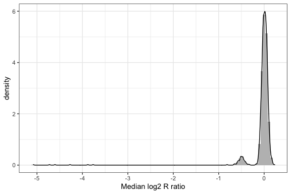
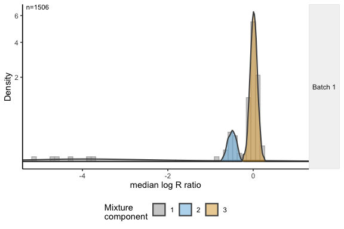
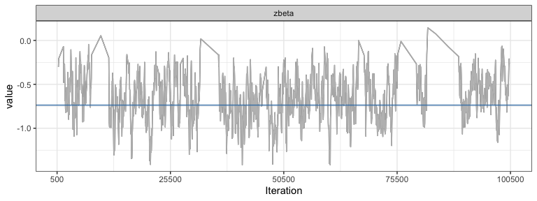

CNPBayes: Copy number estimation and association in large-scale studies
================
Stephen Cristiano, Jacob Carey, David McKean, Gary L. Rosner, Ingo
Ruczinski, Alison Klein, and Robert B. Scharpf
17 June, 2020

# Overview

Germline copy number variants (CNVs) increase risk for many diseases,
yet detection of CNVs and quantifying their contribution to disease risk
in large-scale studies is challenging due to biological and technical
sources of heterogeneity. We developed an approach called CNPBayes to
identify latent batch effects in genome-wide association studies
involving copy number, to provide probabilistic estimates of integer
copy number across the estimated batches, and to fully integrate the
copy number uncertainty in the association model for disease.

# Installation

``` r
## install.packages("devtools")
devtools::install_github("scristia/CNPBayes")
## Requires a working installation of JAGS
install.packages("rjags")
## Working with MCMC output
install.packages("ggmcmc")
```

# Usage and workflow

## Example data

The simplest way to illustrate how to fit finite normal mixture models
in CNPBayes is to start with a `SummarizedExperiment` object provided in
CNPBayes that contains a small slice of data from the Pancreatic Cancer
Case Control Consortium (PanC4) (Childs et al. (2015)). Here, we will
focus on a CNV region on chromosome 8:

``` r
library(tidyr)
library(dplyr)
library(CNPBayes)
library(SummarizedExperiment)
library(ggplot2)
library(rjags)
library(ggmcmc)
extdir <- system.file("extdata", package="CNPBayes")
cnp_se <- readRDS(file.path(extdir, "cnp_se.rds"))
snp_se <- readRDS(file.path(extdir, "snp_se.rds"))
rowRanges(cnp_se)[5]
```

    ## GRanges object with 1 range and 0 metadata columns:
    ##           seqnames            ranges strand
    ##              <Rle>         <IRanges>  <Rle>
    ##   CNP_121     chr8 15401664-15414791      *
    ##   -------
    ##   seqinfo: 86 sequences from hg19 genome

``` r
se <- cnp_se[5, ]
```

## Identifying possible sources of batch effects

Technical sources of variation between groups of samples can potentially
confound statistical inference (Leek et al. (2010)). CNPBayes allows the
analyst to indicate and subsequently evaluate potential sources of batch
effect. Below, we use the chemistry plate on which the samples were
processed as a provisional batch variable, but other sources of
variation such as DNA source, date of library preparation, and
laboratory could be evaluated in a similar fashion. We begin by
calculating the median log2 R ratio in the CNV region for each
individual in the `SummarizedExperiment` object and indicate that
chemistry plate (`se$Sample.Plate`) is a potential source of batch
effects.

``` r
set.seed(1234)
full.data <- median_summary(se,
                            provisional_batch=se$Sample.Plate,
                            THR=-1)
```

We use `kolmogorov_batches` to evaluate whether the empirical cumulative
distribution function (eCDF) of the median log2 R ratios differs between
chemistry plates, and to group chemistry plates with similar eCDFs (see
vignette).

``` r
batched.data <- kolmogorov_batches(full.data, 1e-6)
```

From the 94 chemistry plates in this experiment, we have identified 6
batches. Each batch is comprised of a collection of chemistry plates
that we tabulate below.

``` r
batched.data %>%
    group_by(batch) %>%
    summarize(number_plates = length(unique(provisional_batch)),
              .groups='drop')
```

    ## # A tibble: 6 x 2
    ##   batch number_plates
    ##   <int>         <int>
    ## 1     1            32
    ## 2     2            18
    ## 3     3            15
    ## 4     4             7
    ## 5     5            12
    ## 6     6            10

Finally, we use `down_sample2` to down-sample the observed data since
all 6000+ observations are not needed to approximate the multi-modal
distribution of median log2 R ratios. Since the down-sampling is random,
we set a seed for reproducibility.

``` r
set.seed(1234)
downsampled.data <- down_sample2(batched.data, min_size=250) 
downsampled.data
```

    ## # A tibble: 1,506 x 6
    ##    id      oned provisional_batch batch_labels likely_deletion batch
    ##    <chr>  <dbl> <chr>             <chr>        <lgl>           <int>
    ##  1 3999  -0.062 WG0040402-MSA1    1            FALSE               1
    ##  2 5760   0.062 WG0048476-MSA1    1            FALSE               1
    ##  3 3060  -0.524 WG0052036-MSA1    1            FALSE               1
    ##  4 5968   0.009 WG0046854-MSA1    1            FALSE               1
    ##  5 3424   0.019 WG0039764-MSA1    1            FALSE               1
    ##  6 3028   0.048 WG0046854-MSA1    1            FALSE               1
    ##  7 1886  -0.058 WG0061186-MSA1    1            FALSE               1
    ##  8 2735   0.044 WG0052033-MSA1    1            FALSE               1
    ##  9 1942   0     WG0046853-MSA1    1            FALSE               1
    ## 10 2808   0.052 WG0040404-MSA1    1            FALSE               1
    ## # … with 1,496 more rows

``` r
downsampled.data %>%
    ggplot(aes(oned)) +
    geom_histogram(aes(oned, ..density..), bins=100,
                   fill="gray") +
    geom_density(fill="transparent") +
    theme_bw() +
    xlab("Median log2 R ratio")
```

<div class="figure" style="text-align: center">



<p class="caption">

Down-sampled data

</p>

</div>

## Fitting finite mixture models

The bulk of the data corresponds at this CNV region corresponds to
diploid individuals with median log\(_2 R\) ratios near zero (Figure
“Down-sampled data”). The small cluster immediately adjacent to the
central mode contains subjects with a likely hemizygous deletion, and
the 6 participants scattered at the far left of the graph likely have a
homozygous deletion. Below, we create an object of class `MultiBatch`
that re-organizes the data in a container for fitting mixture models in
CNPBayes. While model selection can be challenging and requires
evaluating many models, here we sidestep these issues and tell CNPBayes
to simply fit models consistent with a deletion polymorphism (i.e, 3 - 4
component models) using the `homdel_model` function.

``` r
## Assume batch effects effects are neglible and that there is a single batch
mb <- MultiBatch("SBP3", data=downsampled.data)
mp <- McmcParams(burnin=100, iter=1000, thin=1)
mcmcParams(mb) <- mp
model <- homdel_model(mb, mp)
```

    ## ....................

``` r
model
```

    ## Model name: SB3 
    ##    n. obs              : 1506 
    ##    n. batches          : 1 
    ##    k                   : 3 
    ##    nobs/batch          : 1506 
    ##    saved mcmc          : 1000 
    ##    log lik (s)         : 1740.5

The resulting `model` object contains information about the type of
model that was fit and the number of mixture components. Here `SB3`
means that the selected model has a single batch (SB) with 3 mixture
components. To assess goodness of fit, we overlay the density of the
posterior predictive distribution on the empirical data using the
`ggMixture` function.

``` r
ggMixture(model) + xlab("median log R ratio") +
    coord_cartesian(xlim=c(-5.1, 1))
```

<div class="figure" style="text-align: center">



<p class="caption">

Posterior predictive distribution from CNPBayes overlaying the median
log2 R ratios.

</p>

</div>

## Genotyping the mixture components

While we have assigned each sample to a mixture component, the mixture
components do not necessarily correspond to distinct copy number states.
Using the available SNPs in the CNV region, we identify the set of
integer copy numbers that would most likely give rise to the observed B
allele frequencies (BAFs). After limiting the SNP `SummarizedExperiment`
object to the CNV region of interest, we call the `genotype_model`
function to map mixture components to integer copy numbers. The
`mapping` accessor returns a character vector of the copy numbers for
each mixture component. Here, we see that the three mixture components
do in fact map to copy numbers 0, 1, and 2.

``` r
snp.chr8 <- subsetByOverlaps(snp_se, se)
gmodel <- genotype_model(model, snp.chr8)
mapping(gmodel)
```

    ## [1] "0" "1" "2"

As we fit the mixture model using a subset of the available data, we
extrapolate the probabilistic estimates of copy number to the entire
population using the `upsample2` function. While we did not make use of
the provisional batch labels in this simple example, the up-sampling
does require that we provide these labels from the full data.

``` r
full <- upsample2(gmodel, full.data)
```

    ## Joining, by = c("batch", "component")

``` r
full
```

    ## # A tibble: 6,038 x 8
    ## # Groups:   id [6,038]
    ##    id    batch copynumber      cn_0     cn_1  cn_2  cn_3  cn_4
    ##    <chr> <dbl>      <int>     <dbl>    <dbl> <dbl> <dbl> <dbl>
    ##  1 1         1          2 0.0000768 7.99e-12  1.00     0     0
    ##  2 10        1          2 0.0000685 1.28e-13  1.00     0     0
    ##  3 100       1          2 0.0000851 2.25e-11  1.00     0     0
    ##  4 1000      1          2 0.000251  5.01e-17  1.00     0     0
    ##  5 1001      1          2 0.0000769 2.00e-14  1.00     0     0
    ##  6 1002      1          2 0.0000678 8.52e-13  1.00     0     0
    ##  7 1003      1          2 0.0000717 3.18e-12  1.00     0     0
    ##  8 1004      1          2 0.0000673 3.13e-13  1.00     0     0
    ##  9 1005      1          2 0.0000722 3.52e-12  1.00     0     0
    ## 10 1006      1          2 0.0000959 5.74e-11  1.00     0     0
    ## # … with 6,028 more rows

``` r
freq <- as.integer(table(full$copynumber))
freq
```

    ## [1]    7  330 5701

``` r
pval <- gap::hwe(freq, data.type="count")$p.x2 
```

    ## Pearson x2=  0.954   , df=   1   , p=    0.3287148

From the above analyses, we find that the frequencies of copy number
states 0, 1, and 2 in this dataset (n = 7, 330, 5701) are consistent
with a deletion allele segregating at Hardy Weinberg equilibrium in the
population.

# Association model

If the mixture components were always as well separated as above,
standard Bayesian and frequentist regression models using the maximum a
posteriori copy number estimate would be appropriate. To illustrate the
approach using a toy example, we simulate disease status for 1000
observations and fit a logistic regression model to evaluate whether
there is an association between copy number and the log odds of cancer.

``` r
b0 <- 1.5
b1 <- -0.75
map_cn_estimates <- full$copynumber[1:1000]
XB <- b0 + b1 * map_cn_estimates
probs <- exp(XB)/(1 + exp(XB))
y  <- rbinom(length(probs), 1, prob=probs)
df <- tibble(y=y, cn=map_cn_estimates)
fit1 <- glm(y~cn, data=df, family=binomial(link="logit"))
coef(summary(fit1))
```

    ##               Estimate Std. Error   z value    Pr(>|z|)
    ## (Intercept)  1.4596673  0.5550053  2.630006 0.008538341
    ## cn          -0.7366034  0.2830051 -2.602792 0.009246801

``` r
glmbeta <- coef(summary(fit1))[2, "Estimate"]
```

Inevitably, many CNV regions will have a lower signal-to-noise ratio and
probabilities for the integer copy number states will reflect the
increased uncertainty. When copy number estimates are uncertain, a
Bayesian logistic regression model can incorporate the uncertainty of
the latent copy number. We include a simple model in JAGS (without other
covariates), passing the posterior probabilities of the integer copy
number assignments to the JAGS model in the variable `P`.

``` r
cn_probs <- ungroup(full[1:1000, ]) %>%
    select(c("cn_0", "cn_1", "cn_2")) %>%
    as.matrix()
jags_data <- list(N=length(y),
                  y=y,
                  P=cn_probs)
jagsdir <- system.file("JAGS", package="CNPBayes")
fit <- jags.model(file.path(jagsdir, "cnv_assoc.jag"),
                  data=jags_data,
                  n.chains=1,
                  n.adapt=500)
samples <- coda.samples(fit,
                        variable.names=c("b0", "b1", "zbeta"),
                        n.iter=2000*50, thin=50) %>%
    ggs()
```

In addition to the regression coefficient for copy number, the jags
model includes a latent indicator variable \(z\) that multiplies the
copy number coefficient. Through Bayesian model averaging, we obtain a
posterior distribution over the odds that an intercept-only model is
adequate. Below, we show the traceplot of the regression coefficient
when \(z\) is 1 and copy number is included in the model:

``` r
b <- filter(samples, Parameter=="zbeta")
b %>%
    filter(value != 0) %>%
    ggs_traceplot() +
    geom_line(color="gray")+
    geom_hline(yintercept=glmbeta, color="steelblue") +
    theme_bw()
```

<div class="figure" style="text-align: center">



<p class="caption">

Traceplot for copy number regression coefficient conditional for
simulations where \(z = 1\).

</p>

</div>

Due to the autocorrelation in this chain, regions of the traceplot near
where \(z\) was zero are still evident – additional thinning and more
iterations would be required to provide a better approximation for the
posterior of the copy number regression coefficient. However, an
advantage of this approach is that we get a direct estimate of the
probability that the regression coefficient for copy number is non-zero
(probability 0.76).

# Related software

cnvCall fits Bayesian hierarchical models of t-distributions assuming
the principal sources of batch effects are known (Cardin et al. (2011)),
building on and extending many of the ideas for modeling copy number
variation in the R package `CnvTools` (Barnes et al. (2008)).
Expection-Maximization implementations of mixture models are available
in the canary package of the Birdsuite software (Korn et al. (2008)).
Mixture model based approaches for modeling copy number at specific
regions of the genome have also been useful in whole exome sequencing
application (e.g., Fromer et al. (2012) and others).

# References

<div id="refs" class="references hanging-indent">

<div id="ref-Barnes2008">

Barnes, Chris, Vincent Plagnol, Tomas Fitzgerald, Richard Redon,
Jonathan Marchini, David Clayton, and Matthew E Hurles. 2008. “A Robust
Statistical Method for Case-Control Association Testing with Copy Number
Variation.” *Nat Genet* 40 (10): 1245–52.
<https://doi.org/10.1038/ng.206>.

</div>

<div id="ref-Cardin2011">

Cardin, Niall, Chris Holmes, Wellcome Trust Case Control Consortium,
Peter Donnelly, and Jonathan Marchini. 2011. “Bayesian Hierarchical
Mixture Modeling to Assign Copy Number from a Targeted Cnv Array.”
*Genet Epidemiol* 35 (6): 536–48. <https://doi.org/10.1002/gepi.20604>.

</div>

<div id="ref-Childs2015">

Childs, Erica J, Evelina Mocci, Daniele Campa, Paige M Bracci, Steven
Gallinger, Michael Goggins, Donghui Li, et al. 2015. “Common Variation
at 2p13.3, 3q29, 7p13 and 17q25.1 Associated with Susceptibility to
Pancreatic Cancer.” *Nature Genetics* 47 (8): 911–16.
<https://doi.org/10.1038/ng.3341>.

</div>

<div id="ref-Fromer2012">

Fromer, Menachem, Jennifer L. Moran, Kimberly Chambert, Eric Banks,
Sarah E. Bergen, Douglas M. Ruderfer, Robert E. Handsaker, et al. 2012.
“Discovery and Statistical Genotyping of Copy-Number Variation from
Whole-Exome Sequencing Depth.” *Am J Hum Genet* 91 (4): 597–607.
<https://doi.org/10.1016/j.ajhg.2012.08.005>.

</div>

<div id="ref-Korn2008">

Korn, Joshua M, Finny G Kuruvilla, Steven A McCarroll, Alec Wysoker,
James Nemesh, Simon Cawley, Earl Hubbell, et al. 2008. “Integrated
Genotype Calling and Association Analysis of SNPs, Common Copy Number
Polymorphisms and Rare CNVs.” *Nat Genet* 40 (10): 1253–60.
<https://doi.org/10.1038/ng.237>.

</div>

<div id="ref-Leek2010">

Leek, Jeffrey T, Robert B Scharpf, Héctor Corrada Bravo, David Simcha,
Benjamin Langmead, W. Evan Johnson, Donald Geman, Keith Baggerly, and
Rafael A Irizarry. 2010. “Tackling the Widespread and Critical Impact of
Batch Effects in High-Throughput Data.” *Nat Rev Genet* 11 (10): 733–39.
<https://doi.org/10.1038/nrg2825>.

</div>

</div>
