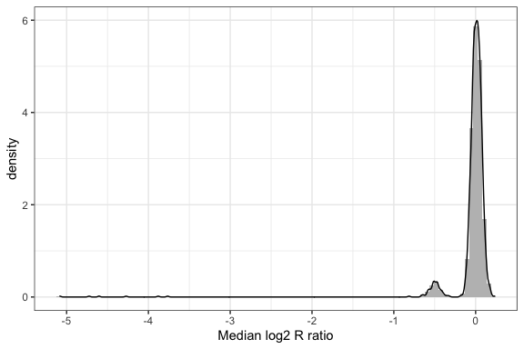
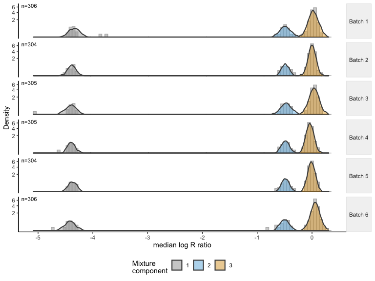

# Overview

Germline copy number variants (CNVs) increase risk for many diseases, yet detection of CNVs and quantifying their contribution to disease risk in large-scale studies is challenging due to biological and technical sources of heterogeneity that vary across the genome within and between samples. We developed an approach called CNPBayes to identify latent batch effects in genome-wide association studies involving copy number, to provide probabilistic estimates of integer copy number across the estimated batches, and to fully integrate the copy number uncertainty in the association model for disease. 

# Installation


```r
## install.packages("devtools")
devtools::install_github("scristia/CNPBayes")
## gap has various functions, some Bayesian, for computing Hardy Weinberg equilibrium
install.packages("gap")
```

# Usage and workflow

## Example data

The simplest way to illustrate how to fit finite normal mixture models in CNPBayes is to start with a `SummarizedExperiment` object provided in CNPBayes that contains median summaries of a few CNV regions for individuals analyzed as part of the Pancreatic Cancer Case Control Consortium (PanC4) @Childs2015.  Here, we will focus on a CNV region on chromosome 8:


```r
library(tidyverse)
```

```
## ── Attaching packages ─────────────────────────────────────── tidyverse 1.3.0 ──
```

```
## ✔ ggplot2 3.3.1     ✔ purrr   0.3.4
## ✔ tibble  3.0.1     ✔ dplyr   1.0.0
## ✔ tidyr   1.1.0     ✔ stringr 1.4.0
## ✔ readr   1.3.1     ✔ forcats 0.5.0
```

```
## ── Conflicts ────────────────────────────────────────── tidyverse_conflicts() ──
## ✖ ggplot2::alpha()    masks CNPBayes::alpha()
## ✖ dplyr::collapse()   masks CNPBayes::collapse(), IRanges::collapse()
## ✖ dplyr::combine()    masks BiocGenerics::combine()
## ✖ dplyr::desc()       masks CNPBayes::desc(), IRanges::desc()
## ✖ tidyr::expand()     masks CNPBayes::expand(), S4Vectors::expand()
## ✖ dplyr::filter()     masks CNPBayes::filter(), stats::filter()
## ✖ dplyr::first()      masks CNPBayes::first(), S4Vectors::first()
## ✖ dplyr::id()         masks CNPBayes::id()
## ✖ purrr::is_null()    masks testthat::is_null()
## ✖ dplyr::lag()        masks stats::lag()
## ✖ dplyr::matches()    masks tidyr::matches(), testthat::matches()
## ✖ dplyr::ntile()      masks CNPBayes::ntile()
## ✖ ggplot2::Position() masks CNPBayes::Position(), BiocGenerics::Position(), base::Position()
## ✖ purrr::reduce()     masks CNPBayes::reduce(), GenomicRanges::reduce(), IRanges::reduce()
## ✖ dplyr::rename()     masks CNPBayes::rename(), S4Vectors::rename()
## ✖ dplyr::slice()      masks CNPBayes::slice(), IRanges::slice()
```

```r
library(CNPBayes)
library(SummarizedExperiment)
```

```
## Loading required package: Biobase
```

```
## Welcome to Bioconductor
## 
##     Vignettes contain introductory material; view with
##     'browseVignettes()'. To cite Bioconductor, see
##     'citation("Biobase")', and for packages 'citation("pkgname")'.
```

```
## Loading required package: DelayedArray
```

```
## Loading required package: matrixStats
```

```
## 
## Attaching package: 'matrixStats'
```

```
## The following objects are masked from 'package:Biobase':
## 
##     anyMissing, rowMedians
```

```
## The following object is masked from 'package:dplyr':
## 
##     count
```

```
## The following object is masked from 'package:CNPBayes':
## 
##     rowRanges
```

```
## 
## Attaching package: 'DelayedArray'
```

```
## The following objects are masked from 'package:matrixStats':
## 
##     colMaxs, colMins, colRanges, rowMaxs, rowMins, rowRanges
```

```
## The following object is masked from 'package:purrr':
## 
##     simplify
```

```
## The following objects are masked from 'package:CNPBayes':
## 
##     colMaxs, rowMaxs
```

```
## The following objects are masked from 'package:base':
## 
##     aperm, apply, rowsum
```

```r
library(ggplot2)
library(rjags)
```

```
## Loading required package: coda
```

```
## 
## Attaching package: 'coda'
```

```
## The following object is masked from 'package:CNPBayes':
## 
##     thin
```

```
## Linked to JAGS 4.3.0
```

```
## Loaded modules: basemod,bugs
```

```r
library(ggmcmc)
```

```
## Registered S3 method overwritten by 'GGally':
##   method from   
##   +.gg   ggplot2
```

```r
extdir <- system.file("extdata", package="CNPBayes")
cnp_se <- readRDS(file.path(extdir, "cnp_se.rds"))
snp_se <- readRDS(file.path(extdir, "snp_se.rds"))
rowRanges(cnp_se)[5]
```

```
## GRanges object with 1 range and 0 metadata columns:
##           seqnames            ranges strand
##              <Rle>         <IRanges>  <Rle>
##   CNP_121     chr8 15401664-15414791      *
##   -------
##   seqinfo: 86 sequences from hg19 genome
```

```r
se <- cnp_se[5, ]
```

## Identifying possible sources of batch effects

As in any large-scale study, sources of technical variation can potentially confound statistical inference @Leek2010. CNPBayes estimates the batches for a given CNV region starting with a provisional definition of batch (chemistry plate on which the samples were processed, the date genomic libraries were prepared, etc.) provided by the user.  Leaving these details  the [vignette](vignettes/cnpbayes.Rmd), here we focus on the logistics of fitting a mixture model in CNPBayes and the subsequent genotyping. The following step uses the `median_summary` function extracts the median log$_2 R$ ratio from the `SummarizedExperiment` object and down-samples the observed data since we can derive useful approximations of the mixture components without all 6000 individuals.  Since the down-sampling is random, it is important to set a seed for reproducibility.


```r
set.seed(1234)
cnv.summaries <- median_summary(se,
                                provisional_batch=se$Sample.Plate,
                                THR=-1) %>%
    down_sample(S=1000) 
cnv.summaries
```

```
## # A tibble: 1,006 x 7
##    id      oned provisional_bat… batch batch_labels likely_deletion is_simulated
##    <chr>  <dbl> <chr>            <dbl> <chr>        <lgl>           <lgl>       
##  1 1004   0.016 WG0061305-MSA1       1 1            FALSE           FALSE       
##  2 623    0.017 WG0040405-MSA1       1 1            FALSE           FALSE       
##  3 2694  -0.055 WG0061185-MSA1       1 1            FALSE           FALSE       
##  4 934    0.024 WG0046833-MSA1       1 1            FALSE           FALSE       
##  5 4499  -0.031 WG0042933-MSA1       1 1            FALSE           FALSE       
##  6 2950  -0.018 WG0051993-MSA1       1 1            FALSE           FALSE       
##  7 2147  -0.095 WG0039762-MSA1       1 1            FALSE           FALSE       
##  8 3177   0.035 WG0039764-MSA1       1 1            FALSE           FALSE       
##  9 2775   0.04  WG0061305-MSA1       1 1            FALSE           FALSE       
## 10 5728  -0.001 WG0061307-MSA1       1 1            FALSE           FALSE       
## # … with 996 more rows
```

```r
## cnv.summaries <- kolmogorov_batches(cnv.summaries, KS_cutoff=0.001, THR=-1)
```

Below, we visualize the down-sampled data and circle the observations in the left-tail that we have flagged as possibly homozygous deletions.


```r
##hd <- tibble(oned=min(oned(mb)))
hd <- filter(cnv.summaries, likely_deletion)
cnv.summaries %>%
    ggplot(aes(oned, ..count..)) +
    geom_histogram(aes(oned, ..density..), bins=200) +
    geom_point(data=hd,
               aes(oned, 0),
               shape=21,
               fill="transparent",
               size=7,
               color="steelblue")  +
    theme_bw() +
    xlab("Median log2 R ratio")
```



## Fitting finite mixture models

The bulk of the data corresponds to diploid individuals with median log$_2 R$ ratios near zero, and the small cluster to the left of this model contains subjects with a hemizygous deletion.  At the very left end of the plot are 6 individual with a likely homozygous deletion that we've circled. Below, we first create an object of class `MultiBatch` that organizes the data in a container that contains parameters for the mixture models.  While the code below instantiates a `MultiBatch` object with 3 components, the only critical piece at this step is the creation of a `MultiBatch` object.  While model selection can be challenging and requires evaluating many models, here we sidestep these issues and tell CNPBayes to focus on models that would be consistent with the deletion polymorphism evident from the preceding figure. Additional details regarding model selection are provided in the vignette.


```r
## Assume batch effects effects are neglible and that there is a single batch
mb <- MultiBatch("MB3", data=cnv.summaries)
mp <- McmcParams(burnin=100, iter=1000, thin=1)
model <- homdel_model(mb, mp, THR=-1)
```

```
## ....................
```

```r
model
```

```
## Model name: SB3 
##    n. obs              : 1006 
##    n. batches          : 1 
##    k                   : 3 
##    nobs/batch          : 1006 
##    saved mcmc          : 1000 
##    log lik (s)         : 1216.1
```

The resulting `model` object contains information about the type of model that was fit and the number of mixture components.  Here `SB3` means that the selected model has a single batch (SB) with 3 mixture components.  If the extreme observations in the left-tail were more rare (or we were fitting a multi-batch model), CNPBayes has an experimental feature where we augment the observed data in the left tail to reinforce our belief that a mixture component should be dedicated to these observations as opposed to a heavy-tailed distribution.  Again, we leave the details to the vignette. To evaluate goodness of fit, we overlay the density of the posterior predictive distribution on the empirical data using the `ggMixture` function, again circling the observed homozygous deletions.


```r
ggMixture(model) +
    xlab("median log R ratio")
```

<div class="figure" style="text-align: center">

<p class="caption">Posterior predictive distribution from CNPBayes overlaying the median log2 R ratios.</p>
</div>

Tools for assessing convergence are provided in the vignette.

## Genotyping the mixture components

While we have assigned each sample to a mixture component, the mixture components do not necessarily correspond to distinct copy number states.  Using the available SNPs in the CNV region, we identify the set of integer copy numbers that would most likely give rise to the observed B allele frequencies (BAFs). After limiting the SNP `SummarizedExperiment` object to the CNV region of interest, we call the `genotype_model` function to map mixture components to integer copy number.  Using the `mapping` accessor, we see that the three mixture components were mapped to the integer copy numbers 0, 1, and 2.


```r
snp.chr8 <- subsetByOverlaps(snp_se, se)
gmodel <- genotype_model(model, snp.chr8)
mapping(gmodel)
```

```
## [1] "0" "1" "2"
```

As we fit the mixture model using a subset of the available data, we extrapolate the probabilistic estimates of copy number to the entire population using the `upsample` function.  While we did not make use of the provisional batch labels in this simple example, the up-sampling does require that we provide these labels from the full data.


```r
full <- upsample(gmodel, se,
                 provisional_batch=se$Sample.Plate)
```

```
## Joining, by = c("batch", "component")
```

```r
full
```

```
## # A tibble: 6,038 x 8
## # Groups:   id [6,038]
##    id    batch copynumber     cn_0     cn_1  cn_2  cn_3  cn_4
##    <chr> <dbl>      <int>    <dbl>    <dbl> <dbl> <dbl> <dbl>
##  1 1         1          2 2.67e-11 4.73e-12  1.00     0     0
##  2 10        1          2 1.59e-11 7.75e-14  1.00     0     0
##  3 100       1          2 3.29e-11 1.33e-11  1.00     0     0
##  4 1000      1          2 2.86e-11 3.71e-17  1.00     0     0
##  5 1001      1          2 1.50e-11 1.24e-14  1.00     0     0
##  6 1002      1          2 1.90e-11 5.07e-13  1.00     0     0
##  7 1003      1          2 2.28e-11 1.88e-12  1.00     0     0
##  8 1004      1          2 1.71e-11 1.87e-13  1.00     0     0
##  9 1005      1          2 2.32e-11 2.08e-12  1.00     0     0
## 10 1006      1          2 4.07e-11 3.43e-11  1.00     0     0
## # … with 6,028 more rows
```

```r
freq <- as.integer(table(full$copynumber))
freq
```

```
## [1]    6  331 5701
```

```r
pval <- gap::hwe(freq, data.type="count")$p.x2 
```

```
## Pearson x2=	0.277	, df=	1	, p=	0.5986094
```

From the above analyses, we find that the frequencies of copy number states 0, 1, and 2 in this dataset (6, 331, 5701) are consistent with a deletion allele segregating at Hardy Weinberg equilibrium in the population.

# Association model

If the mixture components were always as well separated as above, standard Bayesian and frequentist regression models using the maximum a posteriori copy number estimate would be appropriate.  To illustrate the approach using a toy example, we simulate disease status for 1000 observations.


```r
b0 <- 1.5
b1 <- -0.75
map_cn_estimates <- full$copynumber[1:1000]
XB <- b0 + b1 * map_cn_estimates
probs <- exp(XB)/(1 + exp(XB))
y  <- rbinom(length(probs), 1, prob=probs)
df <- tibble(y=y, cn=map_cn_estimates)
fit1 <- glm(y~cn, data=df, family=binomial(link="logit"))
coef(summary(fit1))
```

```
##               Estimate Std. Error   z value    Pr(>|z|)
## (Intercept)  1.3744555  0.5477858  2.509111 0.012103532
## cn          -0.7280187  0.2794706 -2.604992 0.009187631
```

```r
glmbeta <- coef(summary(fit1))[2, "Estimate"]
```

When copy number estimates are uncertain, a Bayesian logistic regression model can easily incorporate the uncertainty of the latent copy number in the regression coefficient standard errors. We include a simple model in JAGS (without other covariates), passing the posterior probabilities of the integer copy number assignments to the JAGS model in the variable `P`.


```r
cn_probs <- ungroup(full[1:1000, ]) %>%
    select(c("cn_0", "cn_1", "cn_2")) %>%
    as.matrix()
jags_data <- list(N=length(y),
                  y=y,
                  P=cn_probs)
jagsdir <- system.file("JAGS", package="CNPBayes")
fit <- jags.model(file.path(jagsdir, "cnv_assoc.jag"),
                  data=jags_data,
                  n.chains=1,
                  n.adapt=500)
samples <- coda.samples(fit,
                        variable.names=c("b0", "b1", "zbeta"),
                        n.iter=2000*50, thin=50) %>%
    ggs()
```

Our jags model includes a latent indicator variable $z$ that multiplies the copy number coefficient. This is essentially Bayesian model averaging where the two models of interest are an intercept-only model and a model that includes copy number.  Below, we show the traceplot of the regression coefficient when $z$ is 1:


```r
b <- filter(samples, Parameter=="zbeta")
b %>%
    filter(value != 0) %>%
    ggs_traceplot() +
    geom_line(color="gray")+
    geom_hline(yintercept=glmbeta, color="steelblue") +
    theme_bw()
```

<div class="figure" style="text-align: center">

<p class="caption">We used a Bayesian model averaging approach to choose between models where the regression coefficient for copy number was non-zero and an intercept-only model.  Here, we show the traceplot for beta when the copy number model was selected.  The horizontal line is the estimate of the regression coefficient from the `glm` model.</p>
</div>

Due to the autocorrelation in this chain, regions of the traceplot near where $z$ was zero are still evident -- additional thinning and more iterations would be required to provide a useful posterior for the $\beta_{cn}$ coefficient. An advantage of this approach is that we get a direct estimate of the probability that the regression coefficient for copy number is non-zero (probability 0.682).


# Related software

cnvCall fits Bayesian hierarchical models of t-distributions assuming the principal sources of batch effects are known (@Cardin2011), building on and extending many of the ideas for modeling copy number variation in the R package `CnvTools` (@Barnes2008).  Expection-Maximization implementations of mixture models are available in the canary package of the Birdsuite software (@Korn2008).  Mixture model based approaches for modeling copy number at specific regions of the genome have also been useful in whole exome sequencing application (e.g., @Fromer2012 and others).

# References

