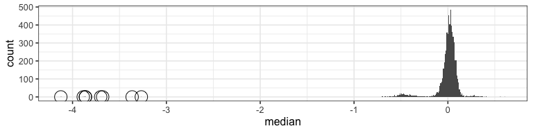
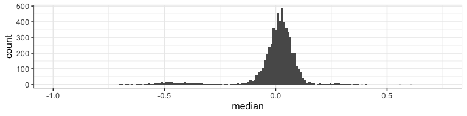
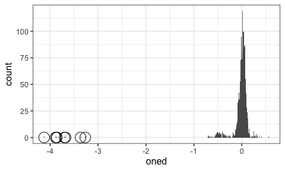
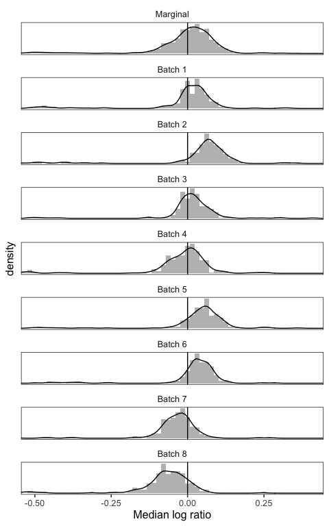
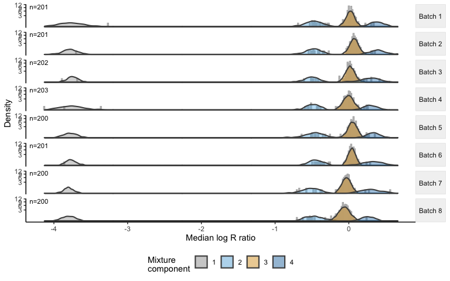
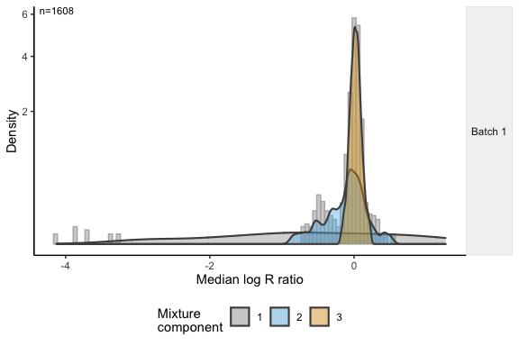
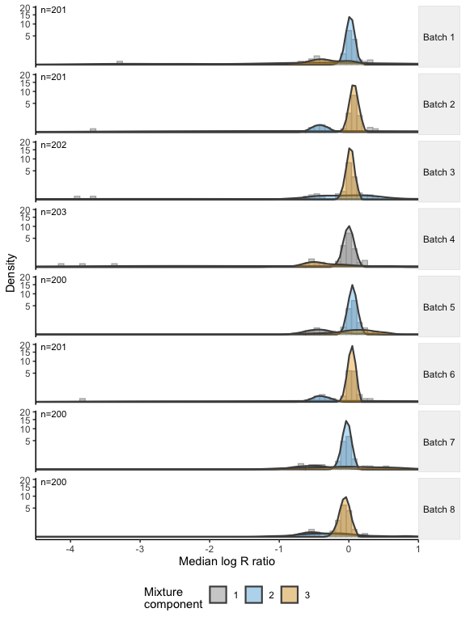
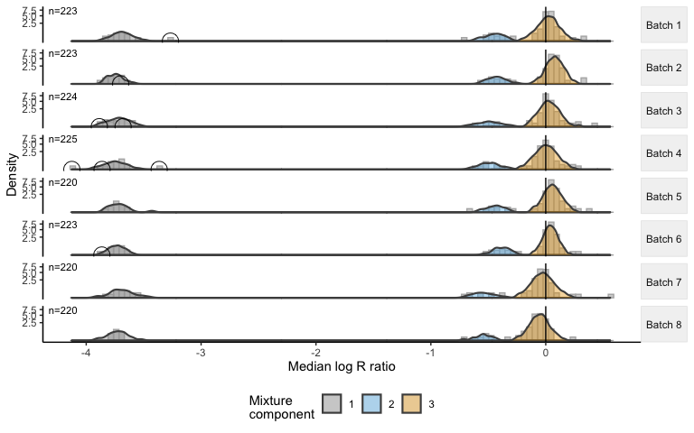
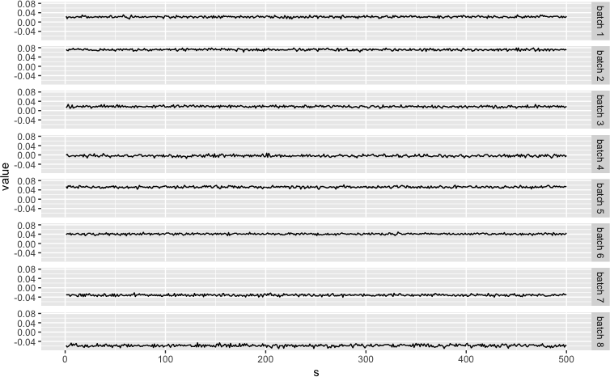

# Overview

Germline copy number variants (CNVs) increase risk for many diseases, yet detection of CNVs and quantifying their contribution to disease risk in large-scale studies is challenging due to biological and technical sources of heterogeneity that vary across the genome within and between samples. We developed an approach called CNPBayes to identify latent batch effects in genome-wide association studies involving copy number, to provide probabilistic estimates of integer copy number across the estimated batches, and to fully integrate the copy number uncertainty in the association model for disease. 

This vignette follows the general outline of the README provided with this package, but provides additional detail on strategies for modeling copy number in the presence of latent batch effects, modeling homozygous deletions when they are rare, and model selection.  The number of MCMC simulations and thoroughness of which any model is evaluated will be inadequate, but we hope this provides general guidance for the overall approach and motivation for some of the modeling decisions.

# Data organization

For SNP arrays, a convenient container for storing SNP-level summaries of log$_2 R$ ratios and B allele frequencies (BAFs) at SNPs along the genome is a `SummarizedExperiment`.   Similarly, for whole exome sequencing, log ratios of normalized coverage for exon-level or gene-level inference can be stored in a `SummarizedExperiment`.  For illustration, we load a small `SummarizedExperiment` containing log$_2 R$ ratios and BAFs from the Pancreatic Cancer Case Control Consortium (PanC4).  This example container includes 7 different CNV regions from multiple chromosomes as can be seen from the `rowRanges`. 


```r
library(tidyverse)
library(SummarizedExperiment)
library(CNPBayes)
library(ggplot2)
library(gap)
library(rjags)
```


```r
extdir <- system.file("extdata", package="CNPBayes")
se <- readRDS(file.path(extdir, "snp_se.rds"))
rowRanges(se)
```

```
## GRanges object with 117 ranges and 1 metadata column:
##              seqnames    ranges strand |       gc
##                 <Rle> <IRanges>  <Rle> | <matrix>
##     rs760925     chr1   1646574      * | 0.450980
##     rs909823     chr1   1647686      * | 0.372549
##      exm4399     chr1   1650787      * | 0.411765
##    rs3817856     chr1   1663831      * | 0.509804
##      exm4428     chr1   1663944      * | 0.725490
##          ...      ...       ...    ... .      ...
##    rs2870438    chr19  53533161      * | 0.490196
##   rs12981308    chr19  53537923      * | 0.509804
##   exm2272801    chr19  53539860      * | 0.509804
##     rs329746    chr19  53539860      * | 0.509804
##     rs329744    chr19  53541112      * | 0.607843
##   -------
##   seqinfo: 24 sequences from hg19 genome
```

The above `se` object contains log ratios and BAFs for 117 SNPs and 6038 samples.  We focus on a CNV region on chromosome 2 that we obtained from the 1000 Genomes Project,  subsetting the `SummarizedExperiment` to 7 SNPs that are contained in this region and calculating median log R ratio for each study participant.  A quick look at the distribution of median log R ratios for the 6,038 participants:


```r
cnv_region <- GRanges("chr2", IRanges(90010895, 90248037),
                      seqinfo=seqinfo(se))
se2 <- subsetByOverlaps(se, cnv_region)
dat <- assays(se2)[["lrr"]] %>%
    colMedians(na.rm=TRUE) %>%
    tibble(median=.)
smallvals <- filter(dat, median < -1)
dat %>%
    ggplot(aes(median)) +
    geom_histogram(bins=500) +
    geom_point(data=smallvals, aes(median, 0),
               shape=21, size=6,
               fill="transparent") +
    theme_bw(base_size=12)
```

<!-- -->

```r
dat %>%
    ggplot(aes(median)) +
    geom_histogram(bins=500) +
    geom_point(data=smallvals, aes(median, 0),
               shape=21, size=6,
               fill="transparent") +
    theme_bw(base_size=12) +
    coord_cartesian(xlim=c(-1, 0.75))
```

<!-- -->

From the histogram, we see that the bulk of the data has a median log R Ratio at 0, but there is a small mode to the left at -0.5 as well as several observations in the far left tail that we've circled. The circled observations are likely homozygous deletions.  For modeling germline copy number, the circled observations are highly informative: they are nearly always well separated from the rest of the data and they suggest that the region is a likely deletion polymorphism.  Before we model this data, we first explore if some of the skew in the central component could be explained by technical sources of variation.  To do this, we will provide a provisional definition of a sample grouping that would enable us to explore differences in these samples that is likely to be technical.  Examples of the provisional batch variable include chemistry plate (below), the date genomic libraries were prepared, DNA source, or study site.  Here, we list chemistry plate as the provisional batch as we think chemistry plate may be a useful surrogate for technical sources of variation arising from PCR and when the samples were processed.  This grouping is provisional in that we acknowledge that many of the plates are likely to be similar.  The function `median_summary` below encapsulates the median log R ratio at this region for each sample, as well as the batch batches and possible homozygous deletions.


```r
provisional_batch <- se2$Sample.Plate
full.data <- median_summary(se2,
                            provisional_batch=provisional_batch,
                            assay_index=2,
                            THR=-1)
full.data
```

```
## # A tibble: 6,038 x 6
##    id      oned provisional_batch batch batch_labels likely_deletion
##    <chr>  <dbl> <chr>             <dbl> <chr>        <lgl>          
##  1 1     -0.019 WG0052036-MSA1        1 1            FALSE          
##  2 2      0.026 WG0061302-MSA1        1 1            FALSE          
##  3 3      0.05  WG0061310-MSA1        1 1            FALSE          
##  4 4     -0.019 WG0046859-MSA1        1 1            FALSE          
##  5 5      0.016 WG0060759-MSA1        1 1            FALSE          
##  6 6     -0.056 WG0037025-MSA1        1 1            FALSE          
##  7 7      0.085 WG0046833-MSA1        1 1            FALSE          
##  8 8      0.049 WG0047852-MSA1        1 1            FALSE          
##  9 9     -0.059 WG0061309-MSA1        1 1            FALSE          
## 10 10     0.006 WG0052033-MSA1        1 1            FALSE          
## # … with 6,028 more rows
```

Next, we compare the empirical cumulative distribution function (eCDF) of the median log R ratios for the provisional batches using a Kolmogorov-Smirnov (KS test). If the p-value for the KS test comparing the eCDF of two provisional batches is greater than a user specified cutoff, the samples in the two provisional batches are combined into a single new batch. Otherwise, the samples are left in separate groups.  The test is repeated recursively until no 2 batches can be combined.  As p-values are sensitive to the size of the study and fitting mixture models with a large number of batches would greatly increase computational complexity, identifying an appropriate cutoff may require trial-and-error. Below, we settled on a cutoff of `1e-6` as this cutoff identified 8 batches from the 94 chemistry plates that were visually distinct.


```r
## P-values are senstive to sample size...
batched.data <- kolmogorov_batches(full.data, 1e-6)    ## 30 more seconds
```

Since all 6038 individuals are not needed to approximate the density of the median log ratios, we take a random sample.  Batches with fewer than `min_size` samples are not down-sampled.


```r
set.seed(134)
downsampled.data <- down_sample2(batched.data, 1000,
                                 min_size=200)
downsampled.data %>%
    ggplot(aes(oned)) +
    geom_histogram(bins=500) +
    geom_point(data=smallvals, aes(median, 0),
               shape=21, size=6,
               fill="transparent") +
    theme_bw(base_size=12)
```

<div class="figure" style="text-align: center">

<p class="caption">Distribution of median log ratios after down-sampling.</p>
</div>


```r
smallvals2 <- filter(downsampled.data, oned < -1)
marginal <- downsampled.data %>%
    mutate(batch=0L, batch_labels="0") %>%
    bind_rows(downsampled.data)
marginal %>%
    ggplot(aes(oned)) +
    geom_histogram(bins=300, aes(y=..density..), fill="gray") +
    geom_density() +
    geom_point(data=smallvals2, aes(oned, 0),
               shape=21, size=6,
               fill="transparent") +
    theme_bw(base_size=12)  +
    theme(panel.grid=element_blank(),
          strip.background=element_blank(),
          axis.text.y=element_blank(),
          axis.ticks.y=element_blank()) +
    facet_wrap(~batch, ncol=1, scales="free_y") +
    geom_vline(xintercept=0) +
    coord_cartesian(xlim=c(-0.5, 0.4)) +
    xlab("Median log ratio")
```

<div class="figure" style="text-align: center">

<p class="caption">Some of the skew in the marginal distribution (top facet) can be explained by technical variation between the estimated batches (batches 1-8). The distribution of the log ratios where the bulk of the data exists appears more symmetric around the mode after stratification by batch.</p>
</div>

# Finite-mixture models

## Approach

We will model the data hierarchically across the estimated batches as a finite-mixture of near-Gaussian densities. Rather than fit an ordinary mixture model and hope that the resulting mixture components have a biologically meaningful interpretation, our approach leverages information about the likely deletion or duplication polymorphisms at these regions.  For this particularly CNV, we have already highlighted that several individuals have a homozygous deletion, indicating that this is a deletion polymorphism (circled observations in Figure @).  CNPBayes allows a many-to-one mapping of mixture components to copy number states but never one-to-many. For example, CNPBayes will only explore models with at least 3 components for a deletion polymorphism.   For a deletion polymorphism, we fit a series of mixture models with different assumptions about the number of batches and whether we should pool variance estimates of the  mixture components.   We use *SB* and *MB* to refer to single-batch and multi-batch models, respectively, and *SBP* or *MBP* to models with pooled variance.  Below, we instantiate an object of class `MultiBatch` that will be used to encapsulate parameters of the mixture model, hyper-parameters, initial values for Markov Chain Monte Carlo (MCMC), and a slot for storing chains from the MCMC.  The `show` method for the `MultiBatch` class provides a concise summary of the data and parameters encapsulated in this object, while `assays` can be used to extract the down-sampled data.


```r
mb <- MultiBatch(data=downsampled.data)
mb
```

```
## Model name: MB3 
##    n. obs              : 1608 
##    n. batches          : 8 
##    k                   : 3 
##    nobs/batch          : 200 201 201 204 200 202 200 200 
##    saved mcmc          : 1000 
##    log lik (s)         :
```

```r
assays(mb)
```

```
## # A tibble: 1,608 x 7
##    id      oned provisional_bat… batch_labels likely_deletion batch is_simulated
##    <chr>  <dbl> <chr>            <chr>        <lgl>           <int> <lgl>       
##  1 3830  -0.269 WG0043207-MSA1   1            FALSE               1 FALSE       
##  2 793    0.015 WG0052036-MSA1   1            FALSE               1 FALSE       
##  3 1907   0.086 WG0053551-MSA1   1            FALSE               1 FALSE       
##  4 356    0.078 WG0052036-MSA1   1            FALSE               1 FALSE       
##  5 4840   0.001 WG0042935-MSA1   1            FALSE               1 FALSE       
##  6 3984   0.087 WG0042935-MSA1   1            FALSE               1 FALSE       
##  7 5797   0.03  WG0053550-MSA1   1            FALSE               1 FALSE       
##  8 1232   0.021 WG0052036-MSA1   1            FALSE               1 FALSE       
##  9 2002   0.061 WG0053551-MSA1   1            FALSE               1 FALSE       
## 10 4242   0.055 WG0042932-MSA1   1            FALSE               1 FALSE       
## # … with 1,598 more rows
```

```r
mp <- McmcParams(iter=500, burnin=200)
```

For now, we postpone the discussion of the set of models that are evaluated by CNPBayes, and instead run a single function `homdeldup_model` that fits a series of models and chooses one.  To assess goodness of fit, we use the function `ggMixture` to overlay the empirical median log R ratios with the density of the posterior predictive distribution from the final model.  The function `genotype_model` maps the mixture components labels to integer copy number using the B allele frequencies stored in the original `SummarizedExperiment` object. Finally, we use `upsample` to obtain probabilistic estimates of the integer copy number as well as the maximum a posteriori copy number for the entire study population.


```r
set.seed(123)
bayes.model <- homdeldup_model(mb, mp)
```

```
## Warmup with SBP4
```

```
## ..........
```

```
## Warmup with SB4
```

```
## ..........
```

```
## Warmup with MBP3
```

```
## ..........
```

```
## Fitting restricted model
```

```
## Warmup with SBP3
```

```
## ..........
```

```
## Warmup with MBP3
```

```
## ..........
```

```
## Data augmentation for homozygous deletions
```

```r
## Assess goodness of fit from posterior predictive distribution
ggMixture(bayes.model[ !isSimulated(bayes.model) ], bins=300)
```

<!-- -->

```r
## Genotype the mixture component labels
genotype.model <- genotype_model(bayes.model, se2)
genotype.model
```

```
## Model name: MB4 
##    n. obs              : 2160 
##    n. batches          : 8 
##    k                   : 4 
##    nobs/batch          : 268 271 271 274 268 272 268 268 
##    saved mcmc          : 500 
##    log lik (s)         : 1126.3
```

```r
mapping(genotype.model)
```

```
## [1] "0" "1" "2" "3"
```

```r
## Provide probabilistic estimates of copy number for the full study
full.study <- upsample2(genotype.model, full.data)
```

```
## Joining, by = c("batch", "component")
```

```r
full.study
```

```
## # A tibble: 6,038 x 8
## # Groups:   id [6,038]
##    id    batch copynumber  cn_0     cn_1  cn_2     cn_3  cn_4
##    <chr> <dbl>      <int> <dbl>    <dbl> <dbl>    <dbl> <dbl>
##  1 1         1          2     0 1.56e- 8  1.00 2.02e-12     0
##  2 2         1          2     0 2.72e-10  1.00 2.68e-10     0
##  3 3         1          2     0 4.32e-11  1.00 4.20e- 9     0
##  4 4         1          2     0 1.56e- 8  1.00 2.02e-12     0
##  5 5         1          2     0 6.26e-10  1.00 8.76e-11     0
##  6 6         1          2     0 7.83e- 7  1.00 4.76e-14     0
##  7 7         1          2     0 4.38e-12  1.00 2.79e- 7     0
##  8 8         1          2     0 4.64e-11  1.00 3.73e- 9     0
##  9 9         1          2     0 1.10e- 6  1.00 3.55e-14     0
## 10 10        1          2     0 1.50e- 9  1.00 2.92e-11     0
## # … with 6,028 more rows
```

As we hypothesized that the CNV region was a deletion polymorphism since a number of individuals had an apparent homozygous deletion, we can check whether the copy number frequencies are consistent with a deletion allele segregating at Hardy Weinberg equilibrium in the population:


```r
cn.freq <- as.integer(table(full.study$copynumber)[1:3])
hwe.stats <- gap::hwe(cn.freq, data.type="count")
```

```
## Pearson x2=	0.761	, df=	1	, p=	0.3830825
```

```r
hwe.stats
```

```
## $allele.freq
## [1] 0.03160195 0.96839805
## 
## $x2
## [1] 0.7607866
## 
## $p.x2
## [1] 0.3830825
## 
## $lrt
## [1] 0.690411
## 
## $p.lrt
## [1] 0.4060246
## 
## $df
## [1] 1
## 
## $rho
## [1] 0.01130862
```

## Model selection

In the previous section, we used the function `homdeldup_model` to evaluate a series of models consistent with deletion and duplication polymorphisms. CNPBayes allows a many-to-one mapping of mixture components to copy number states but never one-to-many,  implying we would need at least 3 components to model the integer copy numbers 0, 1, and 2, and 4 components if duplications are present. The models `homdeldup_model` evaluated underneath the hood included single-batch (SB) finite mixture models with 3 or 4 components (abbreviated as SB3 or SB4) that assume the batch effects were neglible, as well as multi-batch models MB3 and MB4. In addition, we evaluated pooled (P) variance models that assume that mixture components have the same variance denoted as SBP3 and SBP4.  For MBP3 and and MBP4, the mixture components are assumed to have the same variance within a batch, but the variance can differ between batches.  One can fit these models directly by (1) creating a list of models with `MultiBatchList` and selecting one of the possible models in the list and (2) using the function `posteriorSimulation` to samples random deviates from the selected model by MCMC.  In this section, we step through some of the models. 


```r
model.list <- MultiBatchList(data=downsampled.data)
names(model.list)
```

```
##  [1] "SB1"  "SB2"  "SB3"  "SB4"  "SBP2" "SBP3" "SBP4" "MB1"  "MB2"  "MB3" 
## [11] "MB4"  "MBP2" "MBP3" "MBP4"
```

```r
sb3 <- model.list[["SB3"]]
## In practice, one would want to specify more iterations and a larger burnin
iter(sb3) <- 400
burnin(sb3) <- 100
sb3 <- posteriorSimulation(sb3)
ggMixture(sb3)
```

<div class="figure" style="text-align: center">

<p class="caption">The single-batch model has trouble with the heavy-tailed variation near copy number 2 (median log Ratio of 0) where the bulk of the data exists. The non-Gaussian diploid component is largely due to batch effects.</p>
</div>

Evaluating the MB3 model, an obvious dilemma arises in that there were only 8 individuals with homozygous deletions, and these individuals appear in only a subset of batches.


```r
mb3 <- model.list[["MB3"]]
## In practice, one would want to specify more iterations and a larger burnin
iter(mb3) <- 400
burnin(mb3) <- 100
mb3 <- posteriorSimulation(mb3)
ggMixture(mb3, bins=300) +
    coord_cartesian(xlim=c(-4.25, 0.75))
```

<div class="figure" style="text-align: center">

<p class="caption">With the multi-batch model, the diploid mixture component within each batch is more symmetric.  Because homozygous deletions appear in only a subset of the batches and the means are modeled hierarchically, the model tends to use extremely heavy-tailed mixtures to accommodate the individuals with large negative log R ratios.</p>
</div>

Allowing the number of mixture components to vary between batches would greatly increase the model space and likely require joint estimation of the latent copy number for each component so that information is appropriately shared between batches in the hierarchical model.  As homozygous deletions are generally well-separated from the remaining mixture components, CNPBayes currently uses a data augmentation step where additional observations are simulated.  The steps for evaluating these models are to (1) fit a restricted model that excludes the likely deletions, (2) augment the observed data with simulated homozygous deletions, and (3) fit the full model.  We rationalize the augmentation step as analagous to an informative prior on the homozygous deletion component (Figure @).


```r
mbr <- assays(mb3) %>%
    filter(!likely_deletion) %>%
    MultiBatch(data=.)
mcmcParams(mbr) <- mcmcParams(mb3)
restricted <- fit_restricted2(mbr, model="MBP2")
```

```
## Warmup with MBP2
```

```
## ..........
```

```r
augmented.mb3 <- mcmcWithHomDel(mb3, sb3, restricted)
```


```r
smallvals3 <- smallvals2 %>%
    mutate(batch=paste("Batch", batch))
ggMixture(augmented.mb3) +
    geom_point(data=smallvals3, aes(oned, 0),
               shape=21, size=6,
               fill="transparent", inherit.aes=FALSE) +
    geom_vline(xintercept=0)
```



The `augmented.mb3` model does reasonably well (Figure @).  However, note that many of the batches have a few observations in the right tail of the diploid mixture component even after accounting for the differences between batches.  These observations are likely single-copy duplications, but because the duplications are not evident in all of the batches (e.g., batch 4) simply adding a fourth component would be unlikely to capture the single-copy gains.  Again, we use a data augmentation step to ensure that the fourth component captures observations in the right tail of each batch. 

# Evaluating lack of convergence

While we cannot really determine whether a given model has converged, we can usually determine when it has not converged.  Here, we connect the `MultiBatch` objects above with the `coda` and `ggmcmc` packages for MCMC diagnostics. 


```r
ch <- chains(bayes.model)
ch
```

```
## An object of class 'McmcChains'
##     chain dim: 500 x 32 
##     see theta(), sigma2(), p(), ...
```

```r
tmp <- as(ch, "list")
th <- tmp$theta
th %>%
    filter(k == "k 3") %>%
    ggplot(aes(s, value)) +
    geom_line() +
    facet_grid(b~.)
```

<!-- -->
